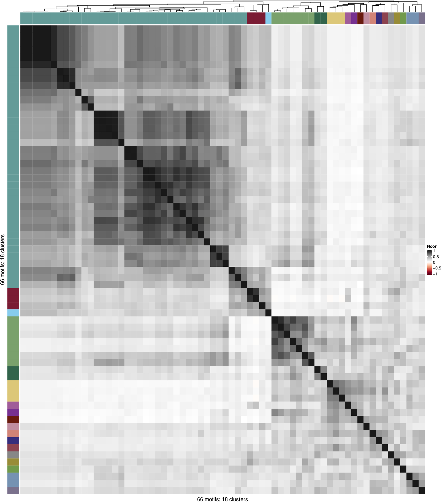
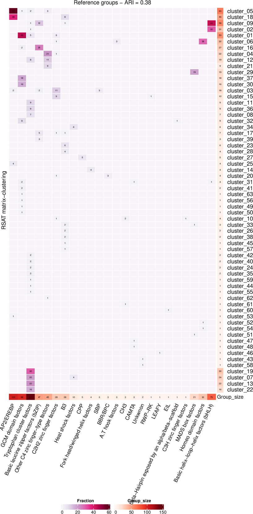
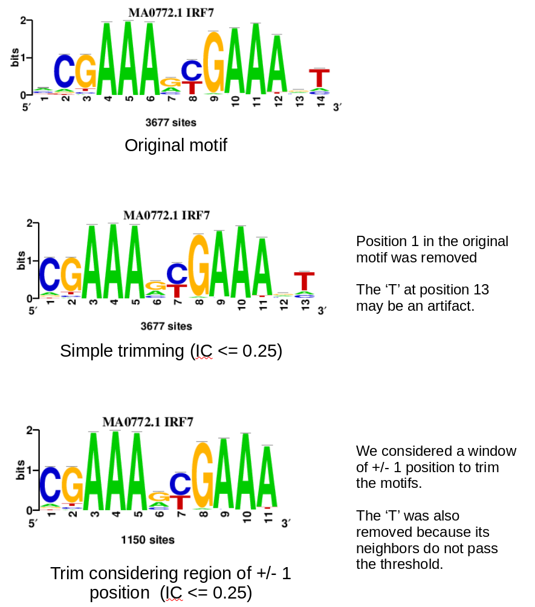

# matrix-clustering_stand-alone

This is a stand-alone version of *RSAT matrix-clustering*. This version is faster and simplified compared to the original one but the graphical output is still under development.

*RSAT matrix-clustering* is a software for Transcription Factor binding motifs clustering and alignment. Here is a brief description of the method:

  - **Motif comparison**: The motifs are compared to each other using two comparison metrics (pearson correlation coeficient (*cor*) and a alignment-width correction (normalized pearson correlation (*Ncor*)).
  - **Hierarchical clustering**: The motifs are hierarchically clustered based in the values of a comparison metric (default = *Ncor*) .
  - **Tree partition**: the hierarchical tree is partitioned by calculating the average *cor* and *Ncor* values at each node, each time a node does not satisfy the thresholds (one value for *cor* and another for *Ncor*) the node is split in two clusters.
  - **Motif alignment**: for each cluster, the motifs are progressively aligned following the linkage order of the hierarchical tree, this ensures that each motif is aligned in relation to its most similar motif in the cluster. 

As in the original version of *RSAT matrix-clustering*, there is no limit in the input motif files (so far we have tried up to 900 input files). When users have two or more input files, some intersection statistics are calculated (e.g., overlap among input collections) visualized as heatmaps.

Originally, *RSAT matrix-clustering* was planned to be part of the [*RSAT* suite](http://www.rsat.eu/) for motif analysis, we decided to create a portable stand-alone version that can be ran without installing the whole *RSAT* environment and that can be easily integrated within pipelines.

&nbsp;
&nbsp;


## Before starting

If you want to run the original version with all the graphical output, you can do it thorugh [*RSAT* website](http://rsat-tagc.univ-mrs.fr/rsat/matrix-clustering_form.cgi) or alternatively, installing *RSAT* locally and run the command line version of *matrix-clustering*.

:warning: This repository is under active development, so we expect many changes as long as you see this line.

The graphical output (interactive trees and heatmaps will be added soon).

&nbsp;

## :wrench: Changes relative to the original version

- We added a new functionality to calculte how well the resulting clusters are similar to a user provided annotation (see **Example 2**) for more details. This functionality could be used to select the parameters (thresholds in `cor` and `Ncor`) that maximizes a user-provided annotation.

- Default threshold are different: `cor = 0.75` and `Ncor = 0.55`. To decide if a node in the hierarchical tree will be merged or split, we compute the average `cor` and `Ncor` of all the pairwise comparisons for all the motifs in a particualr node. We realized that the original version didn't considered all the pairwise comparisons, we corrected this problem, but now the default thresholds are too permissive, so they have to be increased to obtain good results.

&nbsp;
&nbsp;

## :computer: Install required software


### Download this repository

```
git clone https://github.com/jaimicore/matrix-clustering_stand-alone.git
cd matrix-clustering_stand-alone
```

&nbsp;

### R libraries

The following R/Bioconductor packages are required to run *RSAT matrix-clustering*, you can install them within `R` using the following commands

```R
##############################################################
## List of R packages requires in the 'minimal_output' mode ##
##############################################################
required.packages = c("dplyr",          ## Data manipulation
                      "data.table",     ## Read long matrices in a quick way
                      "furrr",          ## Run functions in parallel
                      "optparse",       ## Read command-line arguments
                      "purrr",          ## Iterations
                      "rcartocolor",    ## Cluster colors
                      "reshape2",       ## Dataframe manipulation
                      "this.path",      ## Create relative paths
                      "tidyr",          ## Data manipulation
                      "dendsort",       ## To draw heatmap
                      "RColorBrewer",   ## Heatmap cell colors
                      "ape",            ## Export hclust tree in newick format
                      "RJSONIO",        ## Export hclust tree in JSON format
                      "circlize",       ## Required to draw heatmaps
                      "flexclust")      ## Calculate adjusted rand index


for (lib in required.packages) {
  if (!require(lib, character.only = TRUE)) {
    install.packages(lib)
    suppressPackageStartupMessages(library(lib, character.only = TRUE))
  }
}


############################################
## Install required Bioconductor packages ##
############################################
if (!require("BiocManager", quietly = TRUE))
    install.packages("BiocManager")

BiocManager::install("universalmotif")
BiocManager::install("ComplexHeatmap")
```

&nbsp;

### Compile C dependencies

The motif comparison step is ran by `compare-matrices-quick`, a fast version of `RSAT compare-matrices` implemented in C (with less options but very fast).

This repository contains the script written in `C` but it needs to be compiled to generate the executable script that will be called inside `matrix-clustering`.

Assuming you are in the main directory, after cloning the repository:

```bash
cd compare-matrices-quick
make
```

The makefile contains the commands to compile the `compare-matrices-quick.c` script, after running the makefile, be sure it generated the executable script

```
./compare-matrices-quick
``` 

This should print the help to run `compare-matrices-quick` and the exaplanation of the parameters, but don't worry you don't have to read it, this script will be called within the `R` scripts.

&nbsp;
&nbsp;

## :arrow_forward: Quickstart

Assuming you are in the root of the repository folder you can run the following examples. The input files are part of the repository, they are found in the folder `data`.

### Example 1

Clustering of 66 motifs separated in three motif collections (files). An [Oct4](https://doi.org/10.1016/j.cell.2008.04.043) ChIP-seq dataset was analyzed with three different motif discovery tools (*RSAT peak-motifs*, *MEME-ChIP*, and *HOMER*), the resulting motifs are used as input and we detected a cluster of Oct4 motifs, including the canonical motif, and other binding variants including homodimers and heterodimers, see [Fig 2 of the *RSAT matrix-clustering* paper](https://doi.org/10.1093/nar/gkx314) for a detailed explanation.

:hourglass_flowing_sand: Running time: ~1 minute

```bash
Rscript matrix-clustering.R                          \
  -i data/OCT4_datasets/OCT4_motif_table.txt         \
  -o results/OCT4_motifs_example/OCT4_motif_analysis \
  -w 8                              
```

&nbsp;

### Example 2

We cluster the [*JASPAR 2022 plants*](https://jaspar.genereg.net/matrix-clusters/plants/) motif collection (656 motifs), we compare the resulting clusters detected by *RSAT matrix-clustering* against a user-provided reference annotation (in this case the Transcription Factor classes). We calculated the *Adjusted Rand Index* (ARI), a single-value metric (ranging from -1 to +1) indicating the proportion of consistent pairs between two classifications, in this example the ARI measures the proportion of motif pairs that are consistently classified between *RSAT matrix-clustering* results and the reference TF classes. We consider that a motif pair is consistently classified when the two motifs either belong to the same class and are co-clustered, or belong to different families and are not co-clustered.

The calculation of ARI is a new functionality of *RSAT matrix-clustering*, in this example, using default paramters we obtained `ARI = 0.38`, changing parameters may increase/decrease the resulting ARI.

:hourglass_flowing_sand: Running time: ~5 minutes

```bash
Rscript matrix-clustering.R                         \
  -i data/JASPAR_2022/Jaspar_plants_motifs_tab.txt  \
  -o results/Jaspar_plants/Jaspar_plants            \
  -w 8                                              \
  -r data/JASPAR_2022/Jaspar_2022_plants_TF_fam.tab 
```

&nbsp;
&nbsp;

## :scroll: Input files

### Motifs (Mandatory)

This version of *RSAT matrix-clustering* relies on the R/Bioconductor package `universalmotif` for the motif manipulation steps.
This is the list of supported TF motif formats:

- cluster-buster
- cisbp
- homer
- jaspar
- meme
- transfac
- uniprobe

In case your motif format is not in this list, please contact me to add it.

&nbsp;

### Matrix file table (Mandatory)

To avoid long commands when the input are many motif collections, we opted for a simple file format. The input file (`-i`) must be a tab-delimited file providing the following information (in the following order; no header):

1. Motif file path
2. Collection name: an alias given to the motif file
3. Motif format: see above for the list of supported format.

Each line in this table should correspond to a different motif file.

If a file path is duplicated it will be considered only once.

If a collection name is duplicated, the program will stop, collection names are needed to create unique motif IDs.

Input motifs may be in different formats.

Example:

```bash
data/OCT4_datasets/HOMER_OCT4_motifs.homer    HOMER_motifs	  homer
data/OCT4_datasets/MEME_OCT4_motifs.meme      MEME_motifs	  meme
data/OCT4_datasets/RSAT_OCT4_motifs.tf        RSAT_motifs	  tf
```

&nbsp;

### Reference groups table (Optional)

Users can provide a reference table that will be used to compare it against the resulting clusters (i.e., how good the resulting clusters resemble the reference groupes). When this file is provided the ARI will be calculated.

The reference table (`-r`) must be a tab-delimited file providing the following information (in the following order; no header):

1. Motif ID:
2. Group
3. Collection

The motif IDs in this reference table must be the same IDs as in the motif files, if this is not the case the program will stop.

The collection names in the reference table must be the same as those in the matrix file table, if this is not the case the program will stop.

Example: 
```bash
MA1404.1	BBR/BPC     JASPAR_plants
MA1403.1	BBR/BPC     JASPAR_plants
MA1402.1	BBR/BPC     JASPAR_plants
MA1197.1	CAMTA       JASPAR_plants
MA0969.1	CAMTA       JASPAR_plants
MA0970.1	CAMTA       JASPAR_plants
MA0975.1	AP2/EREBP   JASPAR_plants
MA0976.2	AP2/EREBP   JASPAR_plants
MA1376.1	AP2/EREBP   JASPAR_plants
```

&nbsp;
&nbsp;

## :crystal_ball: Example output:

This is the folder structure after running this software:

```bash
results
├── *_motifs
│   ├── individual_motifs_with_gaps
│   │   └── Two files per motif (direct and reverse orientation) in transfac format, these motifs are already aligned (may contain gaps).
│   │
│   ├── motifs_sep_by_cluster   (each folder contains the motifs belonging to a cluster)
│   │   └── Cluster_01
│   │   └── Cluster_02
│   │   └── ...
│   │   └── Cluster_N
│   │
│   └── root_motifs
│       └── Root_motifs.tf  (also referred as archetype motifs)
│
├── *_plots
│   ├── Clusters_vs_reference_contingency_table.pdf
│   └── Heatmap_clusters.pdf
│   
├── *_tables
│   ├── alignment_table.tab
│   ├── clusters.tab
│   ├── distance_table.tab
│   ├── pairwise_motif_comparison.tab
│   └── summary_table.tab
│
└── *_trees
    ├── tree.json
    ├── tree.newick
    └── tree.RData
```

&nbsp;

### Example 1

The analysis produces the file named `alignment_table.tab` which contains one line per motif with its corresponding cluster name, orientation in the alignment, the number of upstream/downstream gaps, the aligned consensus, and the alignment width.

```bash
cluster	    id	                        name                consensus         rc_consensus                  strand  offset_up offset_down aligned_consensus    alignment_width

cluster_01  RSAT_positions_7nt_m1_n9    positions_7nt_m1    NNATTTGCATATGCAAATNN    NNATTTGCATATGCAAATNN    R       4         0   ----NNATTTGCATATGCAAATNN	24
cluster_01  MEME_MEME_ChIP_1_n1         MEME_ChIP_1         ATGYWAA                 TTWRCAT                 R       7         10  -------TTWRCAT----------	24
cluster_01  MEME_MEME_ChIP_15_n15       MEME_ChIP_15        TATGCAAAT               ATTTGCATA               R       6         9   ------ATTTGCATA---------	24
cluster_01  RSAT_local_words_7nt_m3_n7  local_words_7nt_m3  NNATATGCAAATNN          NNATTTGCATATNN          R       4         6   ----NNATTTGCATATNN------	24
cluster_01  RSAT_oligos_7nt_mkv5_m1_n1  oligos_7nt_mkv5_m1  NNATGCAAATNN            NNATTTGCATNN            R       4         8   ----NNATTTGCATNN--------	24
cluster_01  RSAT_local_words_7nt_m2_n6  local_words_7nt_m2  NHATTTGCATAACAAWNN      NNWTTGTTATGCAAATDN      D       4         2   ----NHATTTGCATAACAAWNN--	24
cluster_01  HOMER_homer_1_n1            homer_1             YWTTNWNATGCAAA          TTTGCATNWNAAWR          R       7         3   -------TTTGCATNWNAAWR---	24
cluster_01  RSAT_local_words_7nt_m4_n8  local_words_7nt_m4  NNATTGTTATGCATAACAATNN  NNATTGTTATGCATAACAATNN  D       0         2   NNATTGTTATGCATAACAATNN--	24
```


The file `clusters.tab` contains one line per cluster with the motifs IDs and names. 

```bash
cluster     id                                                              name
cluster_01  MEME_MEME_ChIP_3_n3,RSAT_oligos_7nt_mkv5_m4_n4,HOMER_homer_9_n9 MEME_ChIP_3,oligos_7nt_mkv5_m4,homer_9
cluster_02  HOMER_homer_6_n6,HOMER_homer_16_n16,HOMER_homer_18_n18          homer_6,homer_16,homer_18
cluster_03  MEME_MEME_ChIP_4_n4,MEME_MEME_ChIP_7_n7                         MEME_ChIP_4,MEME_ChIP_7
cluster_04  RSAT_oligos_7nt_mkv5_m3_n3                                      oligos_7nt_mkv5_m3
```

If the option `--export_heatmap TRUE` is indicated the file `Heatmap_clusters.pdf` will be generated. This is a heatmap of `N x N` where N is the number of motifs, each cell represents the motif similarity. The color annotation bar corresponds to the clusters. 



&nbsp;

### Example 2

When the users provide a reference annotation table (argument `-r` or `--reference_cluster_annotation`) the script will produce a contingency table comparing the resulting clusters and the reference groups, this table is visualized as a heatmap in the file `Clusters_vs_reference_contingency_table.pdf`.



&nbsp;
&nbsp;


## :wrench: Arguments and Options


### Mandatory arguments

 - `-i` or `--matrix_file_table` : A text-delimited file where each line contain the following fields/columns. It does not expect a header, but it expects these columns in the indicated order.
 
    1. Motif file path
    2. Motif collection name
    3. Motif format. 

- `-o` or `--output_folder` : Folder to save the results.


### Comparison + Clustering arguments

- `-m` or `--comparison_metric` : Comparison metric used to build the hierarchical tree. Default: `Ncor`. [Options: `cor`, `Ncor`].
- `-l` or `--linkage_method` : Linkage/agglomeration method to build the hierarchical tree. Default: `average`. [Options: `average`, `complete`, `single`].
- `-c` or `--cor_th` : Pearson correlation lower threshold. Default: `0.75`. [Options: any value among `-1` and `+1`].
- `-n` or `--Ncor_th` : Normalized Pearson correlation lower threshold. Default: `0.55`. [Options: any value among `-1` and `+1`].


### Output files

- `-M` or `--minimal_output` : Only returns the aligned motifs and the alignment, clusters and motif description tables. Comparison results, plots and trees are not exported. Default : `FALSE`. [Options: `TRUE`, `FALSE`].
- `--export_newick` : Export hierarchical tree in Newick format. Default : `FALSE`. [Options: `TRUE`, `FALSE`].
- `--export_heatmap` : Export heatmap with clusters in PDF. Default : `FALSE`. [Options: `TRUE`, `FALSE`].


### Clusters vs Reference annotation

- `-r` or `--reference_cluster_annotation`: User defined cluster annotation tab. Calculates the Adjusted Rand Index (ARI) of the resulting clusters against the reference groups. If the input motifs are separated in many collections, concatenate all the annotations in a single file. A tab-delimited file with two columns, it does not expect a header, but it expects these columns in the indicated order:

    1. Motif ID
    2. Reference group

### Others

- `-w` or `--number_of_workers` : Number of cores to run in parallel. Default: `2`. [Options: depends in your machine].
- `--heatmap_color_palette` : Cell colors in clusters heatmap. Default: `RdGy`. [Options: any colorBrewer palette, see colorbrewer2.org for details ].
- `--color_palette_classes` : Number of classes to create color palette in clusters heatmap. Default: `11`. [Options: depends on the selected colorBrewer palette, see colorbrewer2.org for details ].
  
 
 &nbsp;
 &nbsp;
  
## :collision: Contact + Report issues 

This repository is maintained by [Jaime A Castro-Mondragon](https://jaimicore.github.io/)

:e-mail: j.a.c.mondragon@ncmm.uio.no

Twitter: [@jaimicore](https://twitter.com/jaimicore)

Use this space to report [issues](https://github.com/jaimicore/matrix-clustering_stand-alone/issues) related to this repository.


&nbsp;
&nbsp;

## :pushpin: To Do/Wishlist

- When calculating the ARI, implement an option to find an optimal threshold thorugh a grid search approach.
- Generate the interactive `html` output motif trees.
- Implement the option to annotate clusters.
- Trim root motifs
- Detect the central motif within each cluster.
- Export motif collection intersection stats.

&nbsp;
&nbsp;

## :bangbang: Extra

This repository also contains the script `convert-matrix` which is a simplified version of the `RSAT convert-matrix` tool, for motif manipulation and format conversion.

For the moment this scripts has three main functions:

1. Motif format conversion, see above for the supported formats.
2. Export reverse-complement of the input motifs
3. Trimm motifs (remove columns with low information content).


Simple motif conversion from `transfac` to `meme` format.
```bash
Rscript convert-matrix.R                    \
  -i data/OCT4_datasets/RSAT_OCT4_motifs.tf \
  --from tf --to jaspar                     \
  --output_file results/convert-matrix_examples/RSAT_OCT4_motifs.jaspar
```


Simple motif conversion from `transfac` to `meme` format with reverse-complement motifs.
The file with the reverse-complement motifs has the suffix `_rc` in its name.
In this example:
  - Output: `results/convert-matrix_examples/RSAT_OCT4_motifs.jaspar`
  - Output (RC) : `results/convert-matrix_examples/RSAT_OCT4_motifs_rc.jaspar`
```
Rscript convert-matrix.R                    \
  -i data/OCT4_datasets/RSAT_OCT4_motifs.tf \
  --from tf --to jaspar                     \
  --rc TRUE                                 \
  --output_file results/convert-matrix_examples/RSAT_OCT4_motifs.jaspar
```


Simple motif conversion from `transfac` to `meme` format after motif trimming.
```
Rscript convert-matrix.R                    \
  -i data/OCT4_datasets/RSAT_OCT4_motifs.tf \
  --from tf --to jaspar                     \
  --trimm TRUE --IC_threshold 0.25          \
  --rc TRUE                                 \
  --output_file results/convert-matrix_examples/RSAT_OCT4_motifs_trimmed.jaspar
```


In this figure we show the advantages of using a window-based approach to trim the motifs instead of using a single value, we use as example the [IRF7 motif from JASPAR](https://jaspar.genereg.net/matrix/MA0772.1/).

&nbsp;




&nbsp;
&nbsp;

## :tada: Acknowledgements

We thank the [*JASPAR*](https://jaspar.genereg.net/) curation team for their input to improve *RSAT matrix-clustering*; the [*RSAT developer team*](http://rsat-tagc.univ-mrs.fr/rsat/people.php) for their constant support across many years of collaboration; and the users for their advices, suggestions and reporting bugs :beetle:.

Special thanks to my colleagues Ieva Rauluseviciute (and her *gently reminders* :unamused: that pushed me to write this stand-alone version) and Vipin Kumar (both from [Anthony Mathelier's lab](https://mathelierlab.com/)) for testing this software, the discussions, ideas, and their suggestions of `R` libraries that make this script faster than the original version.

&nbsp;
&nbsp;

## :page_with_curl: How to cite this software?

If you use this software, please cite [its own publication](https://doi.org/10.1093/nar/gkx314) and/or the [latest *RSAT* publication](https://doi.org/10.1093/nar/gkac312).

```
Castro-Mondragon JA, Jaeger S, Thieffry D, Thomas-Chollier M, and van Helden J. 2017. RSAT matrix-clustering: dynamic exploration and redundancy reduction of transcription factor binding motif collections. Nucleic Acids Research

Santana-Garcia W, Castro-Mondragon JA, et al. 2022. RSAT 2022: regulatory sequence analysis tools. Nucleic Acids Research
```
